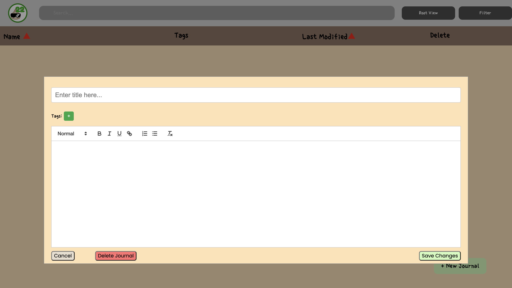

# Project **Garlic**

\

This is a project developed by team 22 of SP24 CSE 110.

### [Link to our Dev Journal](https://cse110-sp24-group22.github.io/cse110-sp24-group22/src/html/home.html)

## Project Description

Our garlic/ tree inspired developer journal is sure to keep your thumb green and your project well documented! In our journal, each entry symbolizes the growth and deepening of your knowledge. This unique journal system stores entries in the "roots" of your tree, representing the foundational knowledge that supports your ongoing software development. With each journal entry, the tree grows, signifying your expanding skills and understanding.

As developers, we want to document daily progress and reflections in a journal that visually represents growth. By storing entries this way, we are seeing growth with each new entry, and can better appreciate the accumulation of knowledge and experience over time. This visualization is a motivation to continue learning and developing skills, while also providing an organized and accessible record of the overall journey.

## Developer Journal

Let's get your project growing!

[Check out our Demo Vid!]() Link Needed!!

### **Features:**
   
- **Tree Growth**
   - With each daily journal that you add, your tree on your home page grows
   - This facilitates documentation, encouraging you to add journals in order to keep your tree growing!

- **Root Growth**
   - The roots of your tree grow to store your journals, as they are the foundation/ thinking in which your project is built off of

- **Journal Tags**
   - You can organize your journals even more by adding personalized tags to any journal you make
   - This makes it easier to go back later and find exactly what you are looking for

- **List View**
   - A more rigid, structured way to view your journals, if you're not feeling too earthy that day

- **Reflective Growth**
  - The visual growth of the tree encourages reflection on personal and professional development over time

### **How to Use:**

**Home/ Root Page**

   - Opening up the homepage brings you to your ungrown tree.
   - Simply press the watering can to add a daily journal and begin growing your tree.
   - Scroll down to the roots of your tree to access your journals by month and day.
  
**List Page**

   - If you don't want to access your journals by the root function, look at them through our list page.
   - You can create new journals through this page as well
   - How to look up your journals?
     - Search by name or contents
     - Filter by tags
     - Sort by name
     - Sort by creation date

## Repository Organization

- `admin\`: Admin resources which incluse branding assets, information on our CI/CD pipeline, weekly meeting notes, our team page, and video links.
- `docs\`: Our JS Documentation
- `specs\`: Our ADRs, brainstorming, pitch information, and wireframe.
- `src\`: Our source code.

## Design Process
- [Link to our Figma](https://www.figma.com/design/jI9imcuPdGE3AL2bU9qolt/Project-Workfllow?node-id=0-1&t=UjUWEJOyvV7pFALc-0): We used this for all asset designing (ie. our background, tree, roots, etc.)
- [Link to our Miro Board](https://miro.com/app/board/uXjVKNpuLc0=/): For general brainstorming and diagram creation we used a Miro board to better visualize what we wanted to do and how we were going to do it
- We also used [Retrium](https://www.retrium.com/) for our retrospective meetings to determine what exactly was working for our team, and what we needed to improve on 

## Testing
We utilized the Jest framework in conjunction with the Puppeteer library to implement unit and end to end (E2E) testing to ensure intended functionality.

## Other Links
- [Team Page](/admin/team.md)
- [Group Intro](https://youtu.be/Pr2DBvsQnfE)
- [Documentation Page](/docs/index.html)
