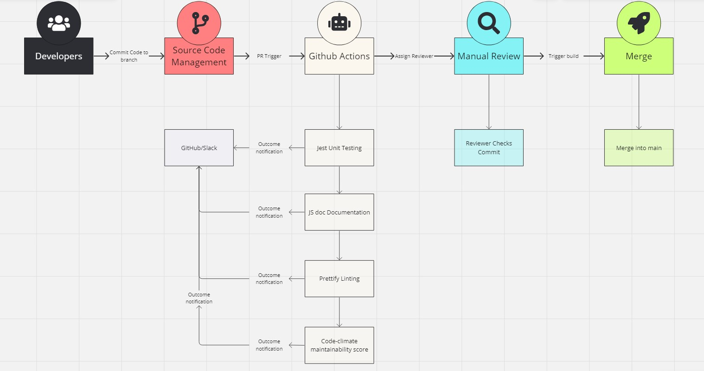

# CI/CD Pipelines for this project

## Unit Testing
- Status: `Active`
- Using: Jest
- Triggered: When merging to `main`
- Requirements to pass:
  - Incremental change to `./__test__/jest`.test.js
  - Passed all unit tests
- Description\
  Using Jest for unit testing. Theoretically, all new features should have corresponding unit tests. Will add more unit testing libs if necessary.
 
## Documentation
- Status: `In Progress`
- Using: JSDocs
- Triggered: When merging to `main`
- Requirements to pass: `None`
- Description\
  JSDocs will generate a doc webpage for our project. But devs **must** annotate their code correctly for JSDocs to compile. Enforcing it when coding.

## Manual Code Review
- Status: `Active`
- Using: GitHub
- Triggered: Pull Request
- Requirements to pass: `manual`
- Description\
  After splitting into small working groups, there will be code reviewers in each group. They will handle PR reviews within the group. Aaron will be reviewing when the branch is merging to `main`.

## Maintainability
- Status: `Active`
- Using: CodeClimate
- Triggered: Every push
- Requirements to pass: `None`
- Description\
  CodeClimate will analyze the repo's maintainability and generate a score. The rubric as follows:

## Lint and Formatting
- Status: `Active`
- Using: Prettier
- Triggered: When merging to `main`
- Requirements to pass: `None`
- Description\
  Prettier will format the code and make an action commit before the branch merges.

## E2E Testing
- Status: `In Progress`
- Using: Prettier
- Triggered: When merging to `main`
- Requirements to pass: `None`
- Description\
  Will add E2E testing when we have a framework of our project.

## CI/CD Diagram

